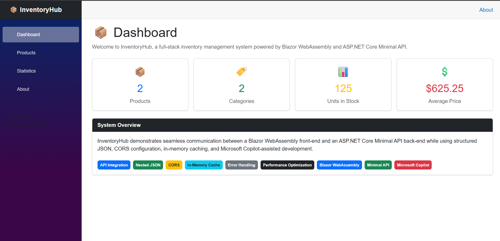
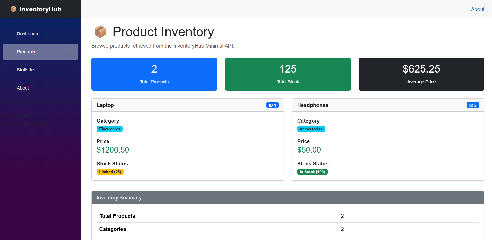
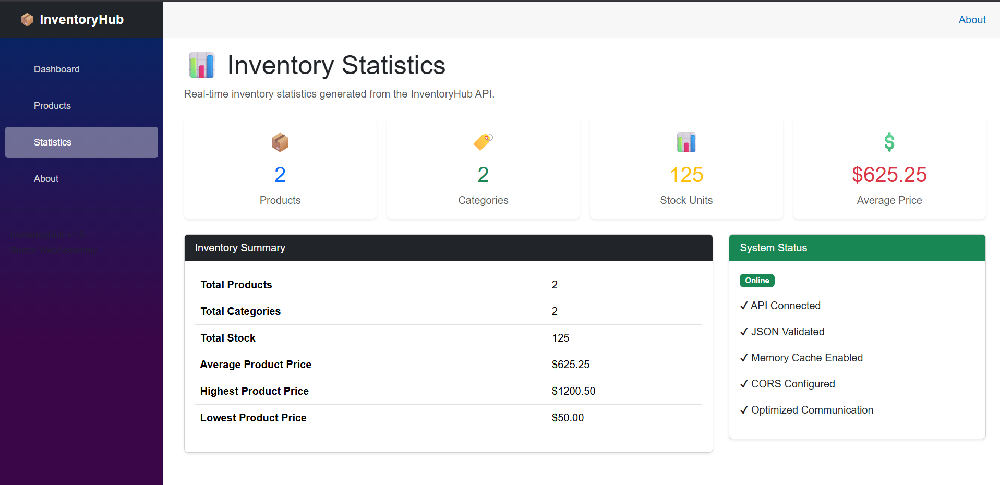
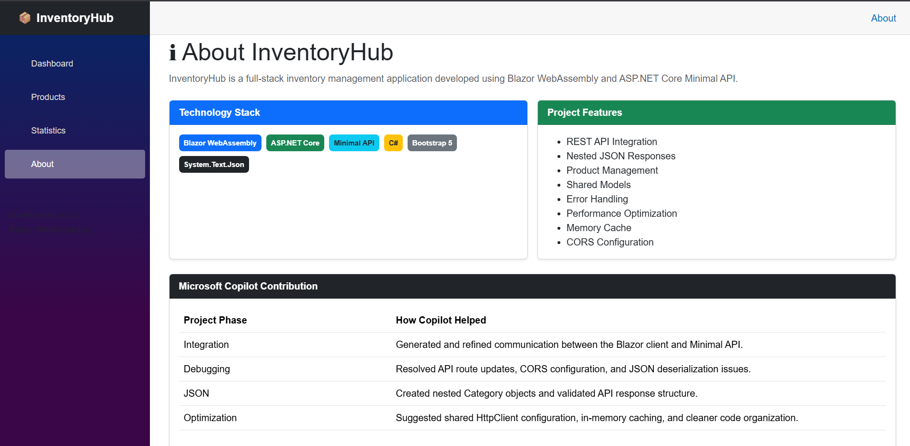

# 📦 InventoryHub

InventoryHub is a full-stack inventory management application developed using **Blazor WebAssembly** and **ASP.NET Core Minimal API**. The project demonstrates front-end and back-end integration, JSON-based API communication, debugging techniques, performance optimization, and Microsoft Copilot-assisted development.

---

## Project Overview

InventoryHub allows users to retrieve product information from a Minimal API and display it in a modern Blazor WebAssembly interface. The project was developed as a capstone assignment that combines API integration, debugging, structured JSON responses, and performance optimization into a single application.

---

## Features

- Dashboard with live inventory statistics
- Product inventory page with responsive product cards
- Statistics page generated from API data
- About page describing the project and technologies
- Responsive user interface using Bootstrap
- Error handling for API communication
- Shared product models
- Nested JSON responses
- Memory caching
- CORS support

---

## Technologies Used

- ASP.NET Core Minimal API
- Blazor WebAssembly (.NET 10)
- C#
- Bootstrap 5
- System.Text.Json
- Microsoft Copilot
- In-Memory Cache

---

## API Endpoint

### GET

```
/api/productlist
```

Example JSON Response

```json
[
  {
    "id": 1,
    "name": "Laptop",
    "price": 1200.50,
    "stock": 25,
    "category": {
      "id": 101,
      "name": "Electronics"
    }
  },
  {
    "id": 2,
    "name": "Headphones",
    "price": 50.00,
    "stock": 100,
    "category": {
      "id": 102,
      "name": "Accessories"
    }
  }
]
```

---

## Performance Optimizations

Microsoft Copilot assisted in improving the application's performance by helping implement:

- Shared HttpClient configuration
- In-Memory caching on the Minimal API
- Reduced redundant API requests
- Cleaner and reusable code
- Improved exception handling
- Better JSON deserialization

---

## Microsoft Copilot Contributions

Microsoft Copilot assisted throughout the project by:

- Generating the initial integration code
- Refining HttpClient communication
- Updating API routes
- Configuring CORS
- Improving JSON deserialization
- Suggesting error handling
- Implementing performance improvements
- Refactoring duplicated code into reusable models

---

## Project Structure

```
FullStackApp
│
├── ClientApp
│   ├── Layout
│   ├── Models
│   ├── Pages
│   └── wwwroot
│
├── ServerApp
│
├── README.md
├── REFLECTION.md
└── FullStackSolution.sln
```

---

## Running the Application

### 1. Start the Server

```
cd ServerApp
dotnet run
```

### 2. Start the Client

```
cd ClientApp
dotnet run
```

### 3. Open the Application

Navigate to the URL displayed by the Client application.

---

## Assignment Objectives Achieved

✔ Front-end and back-end integration

✔ Debugging integration issues

✔ JSON API implementation

✔ Performance optimization

✔ Microsoft Copilot-assisted development

✔ Full-stack application development

---

## GitHub Repository

This project is intended to be submitted through a GitHub repository containing:

- ClientApp
- ServerApp
- Solution file
- README.md
- REFLECTION.md

---

## Author

InventoryHub Capstone Project

Developed using Microsoft Copilot and .NET 10.